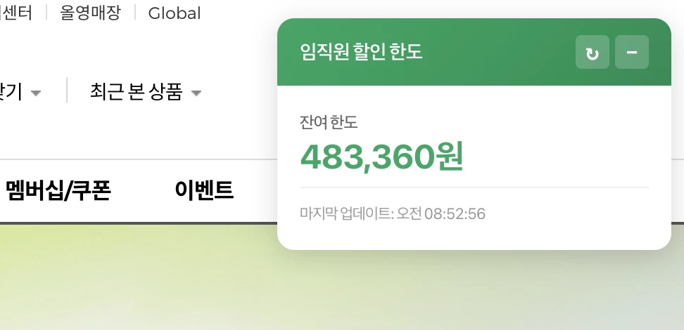
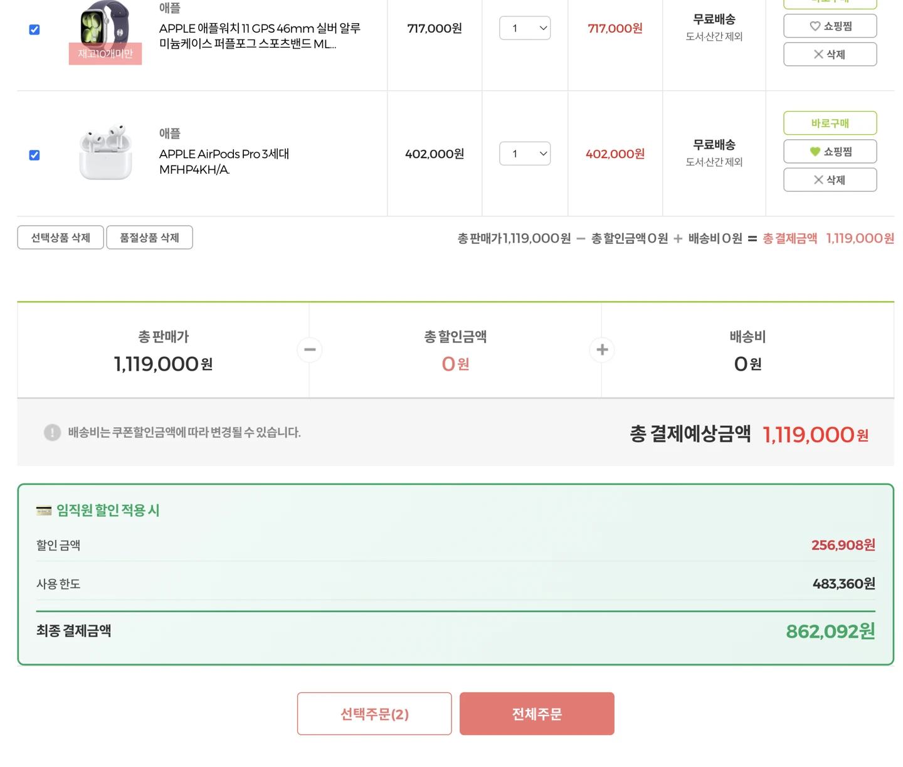
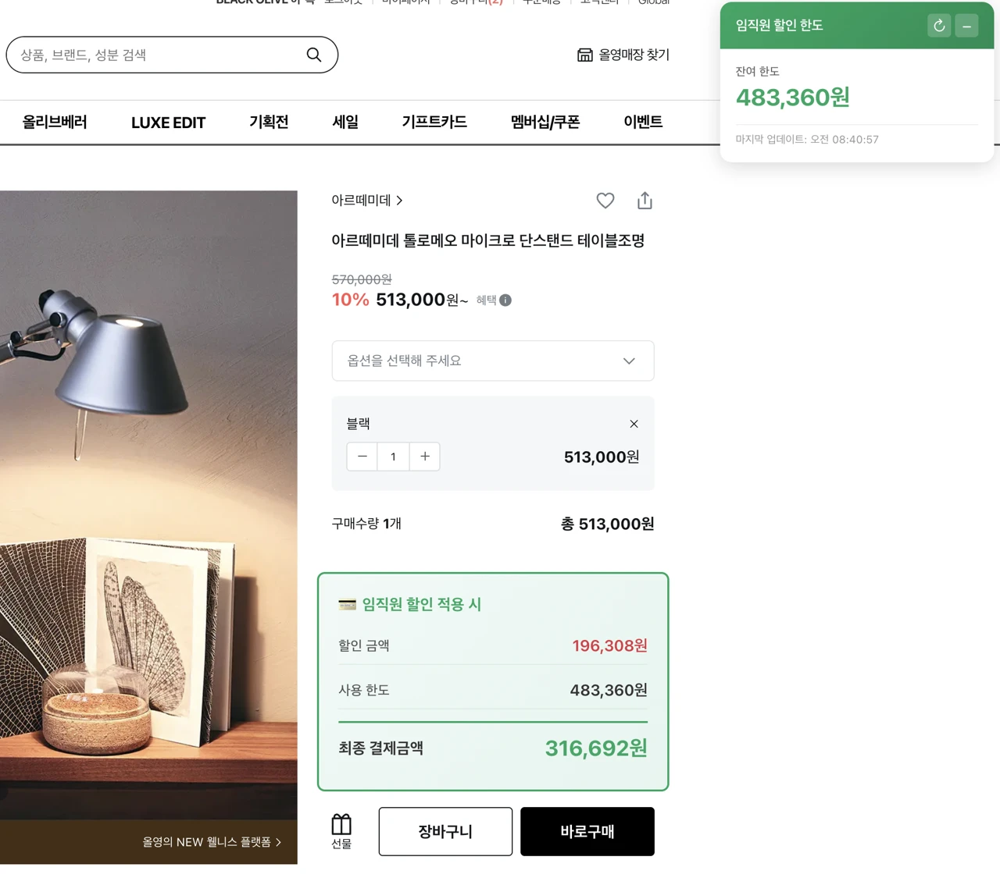
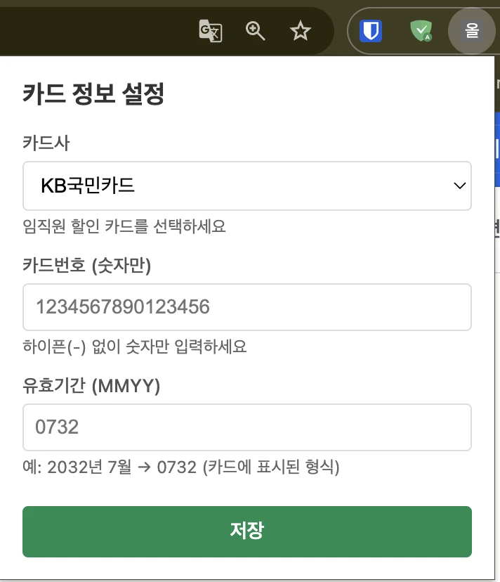

# 올리브영 임직원 할인 한도 조회 확장 프로그램

올리브영 웹사이트에서 CJ 임직원 할인 잔여 한도를 실시간으로 확인하고, 장바구니 및 상품 상세페이지에서 할인 적용 후 최종 결제 금액을 미리 계산해주는 Chrome 확장 프로그램입니다.

## 주요 기능

### 실시간 잔여 한도 조회
- 올리브영 페이지 우측 상단에 플로팅 UI로 잔여 한도 표시
- 새로고침 버튼으로 수동 업데이트 가능
- 5분마다 자동 갱신

### 장바구니 최종 결제금액 계산
- 총 판매가 기준으로 임직원 할인 적용 시 최종 금액 자동 계산

### 상품 상세 페이지 최종 결제 금액 계산
- 쿠폰 적용가 기준으로 임직원 할인 자동 계산
- 수량 변경 시 실시간 재계산

## 할인 계산 방식

- **한도 내 금액**: 40% 할인
- **한도 초과 금액**: 10% 할인

> **예시**: 한도 10만원 남은 상태에서 20만원 구매 시
> - 10만원 × 40% = 4만원 할인
> - 10만원 × 10% = 1만원 할인
> - 최종 결제금액: 15만원

## 설치 방법

### 1. 확장 프로그램 다운로드

[Releases](https://github.com/hyeongrokheo/oliveyoung-credit-card-reminder/releases)에서 최신 ZIP 파일을 다운로드합니다.

### 2. ZIP 파일 압축 해제

다운로드한 `oliveyoung-extension.zip` 파일을 원하는 위치에 압축 해제합니다.

### 3. Chrome 확장 프로그램 로드

1. Chrome 브라우저 주소창에 `chrome://extensions` 입력
2. 우측 상단의 **"개발자 모드"** 토글 활성화
3. 좌측 상단의 **"압축해제된 확장 프로그램을 로드합니다"** 클릭
4. 압축 해제한 폴더(`oliveyoung-credit-card`) 선택

확장 프로그램이 설치되면 주소창 우측에 확장 프로그램 아이콘이 표시됩니다.

## 사용 방법

1. Chrome 우측 상단의 확장 프로그램 아이콘 클릭

2. 카드 정보 입력

   - **카드사**: 임직원 할인 카드사 선택 (KB, 현대, 삼성, 롯데 등)
   - **카드번호**: 하이픈(-) 없이 16자리 숫자만 입력
   - **유효기간**: MMYY 형식으로 입력 (예: 2032년 7월 → `0732`)
3. **"저장"** 버튼 클릭
4. 올리브영 페이지 새로고침

> 로그인 상태에서만 동작합니다.
> 참고용으로만 사용해주세요.

## 보안

- 카드 정보는 사용자의 브라우저에만 저장되며 잔여한도 조회 이외의 목적으로 외부전송되지 않습니다.
- 잔여한도 조회 API는 기존 올리브영 내의 "임직원 카드 잔여 한도 조회" 기능입니다.
- 카드 정보는 Chrome의 `chrome.storage.local` API를 사용하여 로컬에 보관됩니다.

## 라이센스

[MIT](LICENSE)
